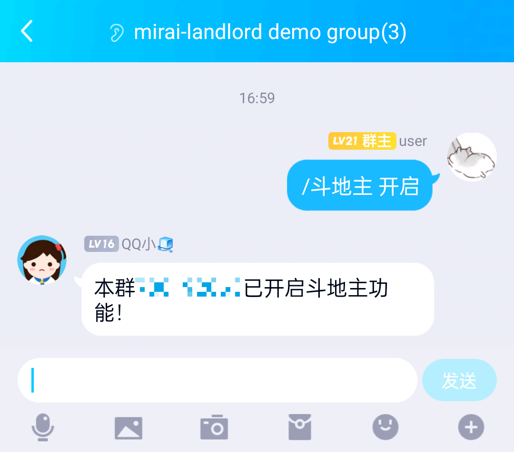
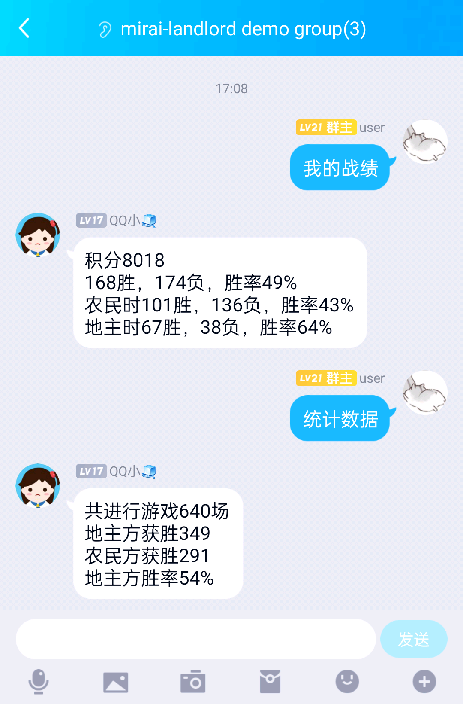

# mirai-landlord (WIP)

**该项目目前仍为测试版**

**Welcome for PRs! 欢迎PR，无论是增加功能、用可读性更高或耦合程度更低的方法改写部分实现都非常欢迎！**

[Mirai机器人](https://github.com/mamoe/mirai)的斗地主插件，由 [Mirai Console](https://github.com/mamoe/mirai-console) 插件模板生成，使用 Kotlin + Gradle。

源代码与更新履历：https://github.com/Michael1015198808/mirai-landlord

移植自[基于酷Q的C++斗地主](https://github.com/doowzs/CQDouDiZhu)

原版源代码：https://github.com/lsjspl/CQDouDiZhu

移植方法基本为直接翻译代码，将循环使用较好理解的函数式写法替代。

代码开发计划请见 [Roadmap](https://github.com/Michael1015198808/mirai-landlord/issues/1)

## Requisite

为了方便对游戏内容进行设置，建议安装[chat-command](https://github.com/project-mirai/chat-command)。

## How to use

### Enabling in some group

如果你安装了chat-command，你只需要在想开启斗地主功能的群中输入`/斗地主 启动`即可开启斗地主功能。



如果你没有安装chat-command，你可以手动修改`config/mirai斗地主插件/groups.yml`为：

```yml
# 将 123456 和 654321 改为要启用斗地主功能的群号
groups:
  - 123456
  - 654321
```

### Disabling in some group

关闭该功能是类似的，使用`/斗地主 关闭`即可。

### Playing

玩家输入`打牌`/`上桌`加入游戏。

凑齐人后输入 `go` 开始游戏。

每个人按顺序决定`抢`/`不抢`。

产生地主后，决定`加倍`/`不加倍`。（加倍过程可以乱序进行）

加倍完后，进入出牌阶段。

（在地主打出牌之前，所有人都可以通过`明牌`来明牌，并使得分数倍率增大。）

出牌时直接输出要打出的牌即可，如`34567`/`44433`。

（注：出牌时可以不按照顺序出牌，如`43434`也会被识别）

完整展示详见[Demo部分](#Demo)

### Others

输入`/斗地主` 可以查看更多配置相关命令，输入`/斗地主 操作`可以查看更多操作。

输入`我的战绩`/`统计数据`即可查看所有玩家的相关信息。



## Demo

